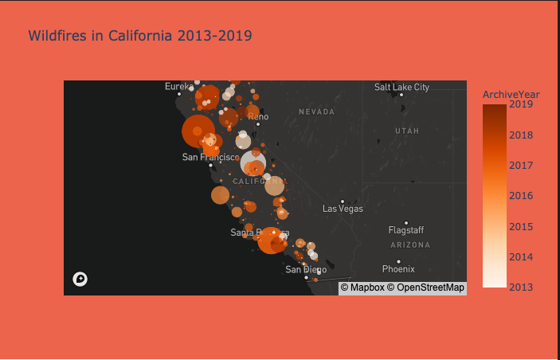
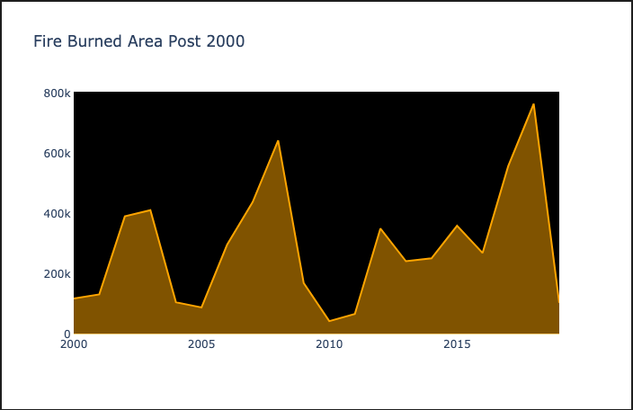
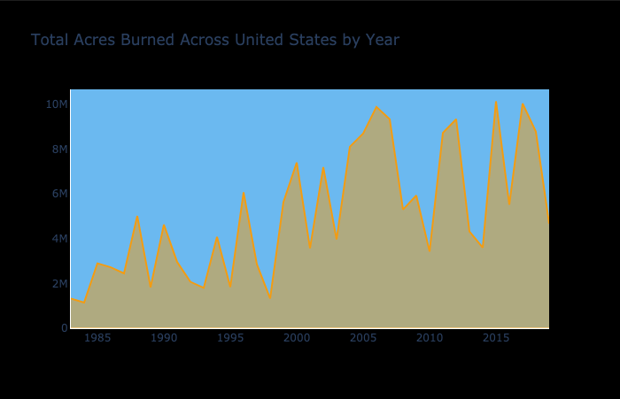

# California Wildfires

Visualize regional influence and trends over the last 100 years.  

## Data Scraping

Data sourced from:  
1. [Wikipedia](https://en.wikipedia.org/wiki/List_of_California_wildfires)
2. [Kaggle](https://www.kaggle.com/ananthu017/california-wildfire-incidents-20132020)
3. [NIFC](https://www.nifc.gov/)
4. [fire.ca.gov](fire.ca.gov) 

## Visuals

California wildfires between 2013-2019 burned the largest areas in the northern and central parts of the state. Wildfires also frequently occur along the coast.

Three peaks, each of a greater hight than the last, are in this plot. A peak represents a season with more area burned than the season before and after. The steep drop following each peak is owed to the decrease in available kindling the next fire season. I would like to look further back in time to see if fire seasons in California have been progressively more intense since the industrial revolution.

This graph puts the California wildfire seasons into the perspective of the entire country. Accross America, the most intense wildfire seasons have burned more acres year by year from 1980-2006, and have held constant 2006-present.